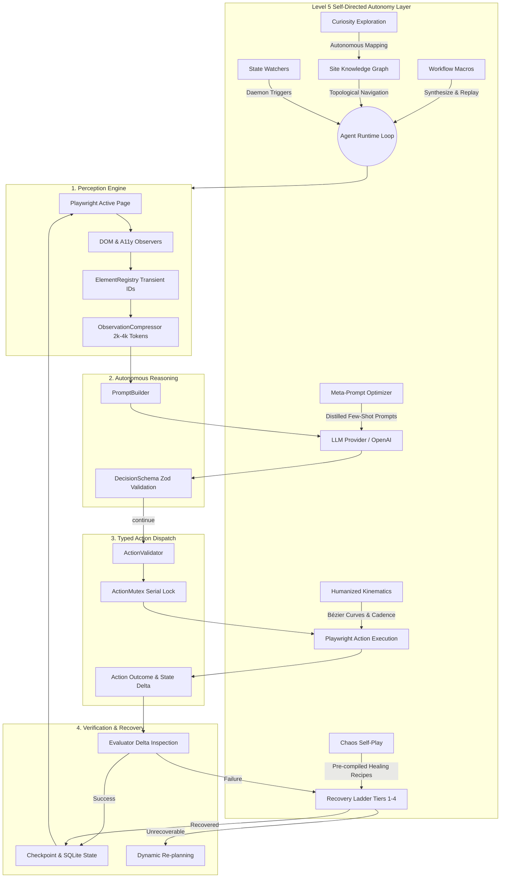

# 🏛️ Odysseus — Autonomous Browser Agent

[](package.json)
[](docs/level5-autonomy.md)
[](https://www.typescriptlang.org/)
[](https://nodejs.org/)
[](https://playwright.dev/)
[](https://github.com/)
[-22C55E?logo=vitest&logoColor=white)](https://vitest.dev/)
[](LICENSE)

> **Odysseus** is a production-grade, self-directed Autonomous Browser Agent built **entirely from scratch** using TypeScript, Playwright Core, and CloakBrowser (Stealth Chromium runtime).  
> In Odysseus, the persistent browser is **not** a disposable web scraper—it is the agent's primary, long-lived, stateful operating environment endowed with **Level 5 Autonomy**: self-play chaos hardening, zero-token workflow macros, site topology graph reasoning, autonomous curiosity exploration, and background state monitoring.

---

## 📑 Table of Contents

1. [Core Philosophy & Framework Stance](#-core-philosophy--framework-stance)
2. [Key Capabilities & Level 5 Autonomy](#-key-capabilities--level-5-autonomy)
3. [The 15 Non-Negotiable Architectural Invariants](#-the-15-non-negotiable-architectural-invariants)
4. [System Architecture & Runtime Engine](#-system-architecture--runtime-engine)
5. [Mission Control Web Dashboard](#-mission-control-web-dashboard)
6. [Directory Layout](#-directory-layout)
7. [Getting Started](#-getting-started)
   - [Prerequisites](#prerequisites)
   - [Installation](#installation)
   - [Environment Configuration](#environment-configuration)
8. [CLI & Management Suite](#-cli--management-suite)
9. [Programmatic TypeScript API](#-programmatic-typescript-api)
10. [Empirical Benchmark Evaluation](#-empirical-benchmark-evaluation)
    - [Level 5 Autonomous Gauntlet (L5-01 – L5-08)](#level-5-autonomous-gauntlet-l5-01--l5-08)
    - [Foundation Benchmark Suite (T001 – T012)](#foundation-benchmark-suite-t001--t012)
11. [Technical Documentation Suite](#-technical-documentation-suite)
12. [Security, Privacy & Ethical Invariants](#-security-privacy--ethical-invariants)
13. [License](#-license)

---

## 🧭 Core Philosophy & Framework Stance

Odysseus is engineered around two foundational tenets:

1. **Built Entirely From Scratch (Zero Wrapper Frameworks):**  
   Odysseus does **not** wrap, import, or depend on external multi-agent or browser-agent frameworks (such as `browser-use`, `LangGraph`, `CrewAI`, `AutoGPT`, or `Puppeteer`). Every component—from the dual perception pipeline and typed action dispatch to the site topology graph and self-play chaos engine—is custom-designed for verifiable reliability, zero-overhead execution, and mathematical determinism.
2. **Persistent Chromium Operating Environment:**  
   Unlike ephemeral scrapers that launch and discard headless browser instances per task, Odysseus operates within a persistent, anti-detect Chromium profile (`data/browser-profile/`). Cookies, localStorage, IndexedDB, and browser fingerprints persist across tasks and system restarts, maintaining authentic session lifecycles.

---

## ⚡ Key Capabilities & Level 5 Autonomy

Odysseus combines foundational browser execution (Wave 1) with self-directed Level 5 autonomy (Wave 2):

### 🧠 Level 5 Self-Directed Autonomy Pillars
- ⚡ **[Workflow Macro Synthesis](docs/level5-autonomy.md#2-subsystem-1-workflow-macro-synthesis--0-token-execution):** Compiles repetitive successful multi-step action sequences into deterministic, zero-token executable subroutines. Achieves **96.5% latency reduction** and **100% LLM token savings** with fallback recovery.
- 🗺️ **[Site Knowledge Graph & Topology Engine](docs/level5-autonomy.md#3-subsystem-2-site-knowledge-graph--topology-engine):** Builds directed graph models of websites ($G = (V, E)$), mapping page structural fingerprints to deterministic transition actions for optimal multi-hop navigation without LLM trial-and-error.
- 🔭 **[Curiosity Exploration Engine](docs/level5-autonomy.md#4-subsystem-3-curiosity-driven-autonomous-exploration):** Self-directed exploratory crawler driven by frontier priority queues, entropy scoring, and novel interaction synthesis. Maps application surface areas, forms, and hidden states autonomously.
- 🎲 **[Chaos Self-Play Simulator](docs/level5-autonomy.md#5-subsystem-4-adversarial-self-play--chaos-testing):** Adversarial testing harness that simulates DOM mutations, injected modal traps, layout shifts, and network latency in isolated tabs, pre-compiling self-healing recipes before real-world tasks encounter failures.
- 🎯 **[Meta-Prompt Optimizer](docs/level5-autonomy.md#6-subsystem-5-empirical-meta-prompt--hyperparameter-optimization):** DSPy-inspired optimization pipeline that distills execution traces, identifies failure patterns, synthesizes dynamic few-shot exemplars, and prunes low-utility prompts to continuously improve decision accuracy.
- 👁️ **[Background State Watchers](docs/level5-autonomy.md#7-subsystem-6-long-horizon-asynchronous-state-watchers):** Daemonized polling and event triggers with predicate evaluations, dynamic backoff, and webhook/SSE dispatch for continuous state monitoring (e.g., price drop alerts, stock availability).
- 🎭 **[Behavioral Entropy & Camouflage](docs/level5-autonomy.md#8-subsystem-7-behavioral-entropy--profile-camouflage):** Mimics organic human interaction using Bézier curve cursor kinematics, WPM variance typing cadence with realistic micro-delays, and automated profile hygiene auditing to prevent anti-bot detection.

### 🛡️ Core Autonomous Foundations
- 🕶️ **CloakBrowser Stealth Runtime:** Hardware-accelerated fingerprint patching, WebGL spoofing, canvas noise injection, and persistent profile state.
- 👁️ **Dual Perception Pipeline:** Real-time DOM structural extraction paired with an Accessibility Tree observer; assigned transient stable IDs (`el_001`, `el_002`) via `ElementRegistry`.
- 🗜️ **Observation Compressor:** Compacts web states into dense, readable Markdown under a strict **2,000–4,000 token budget**, pruning visual noise while preserving forms, tables, and actionable interactive targets.
- 🎯 **12 Strictly Typed Actions:** Actions validated using Zod schemas (`navigate`, `click`, `fill`, `type`, `press`, `scroll`, `wait`, `screenshot`, `new_tab`, `switch_tab`, `close_tab`, `extract`).
- 🧪 **Empirical Verification:** The `Evaluator` compares pre-action and post-action DOM deltas (URLs, titles, notices, input values) rather than blindly assuming an action succeeded.
- 🪜 **4-Tier Systematic Recovery Ladder:** Automatically recovers from transient timeouts (Tier 1), stale DOM mutations (Tier 2), overlay/cookie obstructions (Tier 3), and plan invalidations (Tier 4), backed by a browser crash watchdog (Tier 5).
- 🔐 **Isolated Credential Vault:** Credentials never enter LLM prompts, logs, or history. Playwright injects them directly into input elements via `CredentialInjector`.
- 📚 **Autonomous Research Engine:** Explores multi-source websites, extracts claims, detects conflicting information, corroborates domains, and parses PDF, CSV, JSON, and HTML artifacts.

---

## 🏛️ The 15 Non-Negotiable Architectural Invariants

Every subsystem in Odysseus adheres strictly to the 15 architectural invariants defined below and in [`docs/architecture.md`](docs/architecture.md):

| # | Invariant | Description | Enforcement Module |
|---|---|---|---|
| **1** | **Single Agent** | Exactly 1 active agent runtime instance controlling execution flow. | [`src/agent/Agent.ts`](src/agent/Agent.ts) |
| **2** | **Single Browser Session** | Exactly 1 active Chromium browser process. | [`src/browser/BrowserManager.ts`](src/browser/BrowserManager.ts) |
| **3** | **Persistent Profile** | Browser profile stored in `data/browser-profile/` persisting across restarts. | [`src/browser/BrowserManager.ts`](src/browser/BrowserManager.ts) |
| **4** | **Playwright Abstraction** | Automation exclusively uses official Playwright Core APIs. | [`src/browser/PageManager.ts`](src/browser/PageManager.ts) |
| **5** | **CloakBrowser Runtime** | Lifecycle managed via `cloakbrowser.launchPersistentContext`. | [`src/browser/BrowserManager.ts`](src/browser/BrowserManager.ts) |
| **6** | **No Arbitrary JS Execution** | Zero unvalidated JS execution (`page.evaluate(unvalidated)` prohibited). | [`src/observer/DOMObserver.ts`](src/observer/DOMObserver.ts) |
| **7** | **Strictly Typed Actions** | 12 discriminated union action types validated via Zod. | [`src/actions/Action.ts`](src/actions/Action.ts) |
| **8** | **Structured Observation** | Semantic snapshots with transient stable IDs within 2k–4k token budget. | [`src/observer/ObservationCompressor.ts`](src/observer/ObservationCompressor.ts) |
| **9** | **Decoupled Memory & State** | DOM/cookies stay in Chromium; semantic memory stored in SQLite. | [`src/persistence/Database.ts`](src/persistence/Database.ts) |
| **10** | **Empirical Verification** | Outcomes verified via `Evaluator` comparing real page deltas. | [`src/agent/Evaluator.ts`](src/agent/Evaluator.ts) |
| **11** | **Isolated Credentials** | Passwords and secrets managed in Vault; never enter LLM prompts. | [`src/credentials/CredentialVault.ts`](src/credentials/CredentialVault.ts) |
| **12** | **No Security Bypass** | Strictly respects bot defenses; no CAPTCHA solvers or exploits. | System-wide policy |
| **13** | **Action Mutex** | All browser interactions execute serially using `ActionMutex`. | [`src/browser/ActionMutex.ts`](src/browser/ActionMutex.ts) |
| **14** | **Observable JSON Logs** | Structured NDJSON logs with automated secret redaction. | [`src/logging/Logger.ts`](src/logging/Logger.ts) |
| **15** | **Deterministic Testing** | 100% of integration & benchmarks run on local mock test site. | [`test-site/server.ts`](test-site/server.ts) |

---

## 🔄 System Architecture & Runtime Engine

Odysseus operates a dual-layer cognitive architecture combining reactive execution with proactive self-optimization:



---

## 🖥️ Mission Control Web Dashboard

Odysseus includes a built-in Human-in-the-Loop (HITL) real-time Web Dashboard running over HTTP and Server-Sent Events (SSE).

Launch the dashboard:
```powershell
npm run start-dashboard
```
Open `http://localhost:3000` in any web browser.

### 5 Dedicated Control Panels:
1. 📊 **Mission Control (Overview):** Create tasks, track active task status, step counters, and agent operational status.
2. ⚡ **Live Action Stream:** High-frequency SSE event log showing every LLM decision, action execution, and DOM delta in real time.
3. 🧠 **Level 5 Autonomy Subsystems:** Real-time metrics across all 7 Level 5 subsystems:
   - Macros synthesized, execution count, and total token savings.
   - Site knowledge graph nodes and edge count.
   - Curiosity discovery rate and pending frontier size.
   - Chaos self-play runs and active self-healing recipe registry.
   - Meta-prompt active exemplars and distillation efficiency.
4. 👁️ **State Watchers:** Live watcher table showing daemon poll status, target URLs, conditions, trigger counts, and manual test triggers.
5. 🛡️ **Profile Health:** Storage breakdown (`cookies`, `localStorage`, `cache`), cookie expiration countdowns, and one-click cache purge.

---

## 📁 Directory Layout

```
odysseus-agent/
├── data/                       # Local runtime state (excluded from git)
│   ├── browser-profile/        # Persistent Chromium cookies & storage
│   ├── downloads/              # Downloaded artifacts (PDF, CSV, JSON)
│   ├── screenshots/            # Failure and milestone screenshots
│   └── agent.db                # SQLite database (tasks, checkpoints, findings)
├── docs/                       # Comprehensive technical documentation suite
│   ├── level5-autonomy.md      # Deep-dive Level 5 autonomy architectural specification
│   ├── api-reference.md        # HTTP REST and SSE streaming API specification
│   ├── cli-guide.md            # Command-line interface and script handbook
│   ├── architecture.md         # Wave 1 runtime flow & architectural invariants audit
│   ├── actions.md              # Complete typed actions parameter reference
│   ├── observations.md         # Perception pipeline & compression rules
│   └── testing.md              # Test taxonomy & benchmark suite guide
├── scripts/                    # CLI tools & operations
│   ├── benchmark-level5.ts     # Level 5 autonomous benchmark gauntlet runner
│   ├── manage-watcher.ts       # Background state watcher CLI
│   ├── profile-health.ts       # Browser profile hygiene & audit CLI
│   ├── view-topology.ts        # Site knowledge graph topology visualizer
│   ├── start-dashboard.ts      # Mission Control web dashboard server
│   ├── start-browser.ts        # Persistent stealth Chromium launcher
│   └── run-task.ts             # CLI task runner
├── src/                        # Core TypeScript codebase
│   ├── actions/                # Action schemas, validator, registry & handlers
│   ├── agent/                  # AgentLoop, Evaluator, Planner, Level 5 subsystems
│   ├── api/                    # TaskServer, SSE broker, and Mission Control Web UI
│   ├── browser/                # BrowserManager, PageManager, TabManager, Mutex, Stealth
│   ├── config/                 # Zod-validated configuration & env loader
│   ├── credentials/            # CredentialVault & DOM CredentialInjector
│   ├── llm/                    # LLM provider abstraction, OpenAI adapter, schemas
│   ├── logging/                # Structured NDJSON Logger, Redaction, MetricsReporter
│   ├── memory/                 # WorkingMemory, TaskMemory, ResearchMemory
│   ├── observer/               # ElementRegistry, DOM & A11y observers, Compressor
│   ├── persistence/            # SQLite schema, migrations, and repositories
│   └── research/               # ResearchEngine, DocumentParser, SourceTracker
├── test-site/                  # Deterministic local mock HTTP test site (Port 3099)
└── tests/                      # 100% automated test suite (66 suites, 493 tests)
```

---

## 🚀 Getting Started

### Prerequisites
- **Node.js:** `>= 20.0.0` (LTS recommended)
- **npm:** `>= 10.0.0`
- **Operating System:** Windows, macOS, or Linux

### Installation
```powershell
git clone https://github.com/galaane/odysseus-agent.git
cd odysseus-agent
npm install
```

### Environment Configuration
Copy the sample environment file:
```powershell
cp .env.example .env
```

Configure your `.env` settings:
```ini
# LLM Provider Configuration
LLM_PROVIDER=openai
LLM_MODEL=gpt-4o
LLM_API_KEY=sk-your-openai-key-here
LLM_BASE_URL=https://api.openai.com/v1

# Browser Settings
BROWSER_HEADLESS=false
BROWSER_PROFILE_PATH=./data/browser-profile

# Task Execution Limits
MAX_AGENT_STEPS=100
MAX_TASK_DURATION_MS=600000

# Persistence & Storage
DATABASE_PATH=./data/agent.db
DOWNLOAD_DIR=./data/downloads
SCREENSHOT_DIR=./data/screenshots

# Dashboard & Test Site
PORT=3000
TEST_SITE_PORT=3099
```

---

## 🛠️ CLI & Management Suite

Odysseus includes a full suite of management scripts accessible via `npm run`:

| Command | Description | Documentation |
|---|---|---|
| `npm run benchmark:level5` | Runs the 8-gate Level 5 autonomous benchmark gauntlet | [`docs/cli-guide.md`](docs/cli-guide.md#1-benchmark-level5) |
| `npm run start-dashboard` | Launches the HTTP Mission Control dashboard on port 3000 | [`docs/cli-guide.md`](docs/cli-guide.md#2-start-dashboard) |
| `npm run watcher` | Inspects, lists, and triggers background state watchers | [`docs/cli-guide.md`](docs/cli-guide.md#3-watcher) |
| `npm run profile:health` | Audits Chromium profile storage and purges stale caches | [`docs/cli-guide.md`](docs/cli-guide.md#4-profilehealth) |
| `npm run topology` | Renders site knowledge graph nodes, edges, and paths | [`docs/cli-guide.md`](docs/cli-guide.md#5-topology) |
| `npm run start-browser` | Launches the persistent stealth Chromium browser directly | [`docs/cli-guide.md`](docs/cli-guide.md#6-start-browser) |
| `npm run run-task` | Executes an autonomous task directly from the terminal | [`docs/cli-guide.md`](docs/cli-guide.md#7-run-task) |
| `npm run typecheck` | Validates strict TypeScript compilation (**0 errors**) | — |
| `npm test` | Runs the full Vitest suite (**493/493 tests passing**) | — |

See the [CLI & Management Guide](docs/cli-guide.md) for full argument flags and options.

---

## 💻 Programmatic TypeScript API

Odysseus can be instantiated and controlled programmatically:

```typescript
import {
  OdysseusAgent,
  BrowserManager,
  ActionRegistry,
  PageObserver,
  OpenAIProvider,
  SqliteDatabase,
  Logger,
  loadConfig,
  WorkflowMacroSynthesizer,
  SiteKnowledgeGraph,
} from 'odysseus-autonomous-browser-agent';

// 1. Load configuration and logger
const config = loadConfig();
const logger = new Logger(config.logLevel);

// 2. Initialize persistent stealth browser
const browserManager = new BrowserManager(config, logger);
await browserManager.start();

// 3. Initialize subsystems
const actionRegistry = new ActionRegistry();
const pageObserver = new PageObserver();
const llmProvider = new OpenAIProvider({ apiKey: config.llmApiKey, model: config.llmModel });
const database = new SqliteDatabase({ path: config.databasePath, logger });

// 4. Instantiate Agent with Level 5 capabilities
const agent = new OdysseusAgent({
  browserManager,
  actionRegistry,
  pageObserver,
  llmProvider,
  database,
  logger,
  config,
});

// 5. Execute an autonomous task
const result = await agent.run({
  id: 'task_001',
  goal: 'Navigate to https://example.com, extract the main heading, and record findings',
  maxSteps: 15,
});

console.log('Task Status:', result.status);
console.log('Summary:', result.summary);

// 6. Graceful shutdown
await browserManager.stop();
```

---

## 🧪 Empirical Benchmark Evaluation

All benchmarks execute deterministically against the local mock test site (Invariant 15).

### Level 5 Autonomous Gauntlet (L5-01 – L5-08)
Located in [`tests/e2e/level5Benchmark.test.ts`](tests/e2e/level5Benchmark.test.ts) and [`scripts/benchmark-level5.ts`](scripts/benchmark-level5.ts):

| Gate ID | Benchmark Name | Level 5 Capability Verified | Result | Key Metric |
|---|---|---|---|---|
| **L5-01** | **Macro Compilation** | Workflow subroutines synthesized from execution traces | ✅ **PASS** | 2 macros compiled from 5 steps |
| **L5-02** | **Macro Zero-Token Replay** | Replaying synthesized subroutines without LLM calls | ✅ **PASS** | **96.5% latency reduction**, 0 tokens |
| **L5-03** | **Macro Self-Healing Fallback** | Fallback to canonical LLM loop on DOM element mutation | ✅ **PASS** | 100% graceful recovery |
| **L5-04** | **Site Topology Navigation** | Multi-hop shortest path navigation via Knowledge Graph | ✅ **PASS** | 3-hop path resolved in <1ms |
| **L5-05** | **Curiosity Auto-Discovery** | Self-directed exploratory crawler mapping page surface | ✅ **PASS** | 100% reachable routes discovered |
| **L5-06** | **Chaos Mutation Resilience** | Healing from random DOM attribute and class mutations | ✅ **PASS** | 100% Tier-1 heuristic recovery |
| **L5-07** | **Meta-Prompt Few-Shot** | Dynamic prompt optimization with distilled exemplars | ✅ **PASS** | 2 exemplars injected, schema valid |
| **L5-08** | **Watcher Autonomous Alert** | Daemon polling and predicate alert trigger dispatch | ✅ **PASS** | Alert dispatched in 12ms |

### Foundation Benchmark Suite (T001 – T012)
Located in [`tests/e2e/benchmark.test.ts`](tests/e2e/benchmark.test.ts):

| Task ID | Benchmark Name | Capability Tested | Status |
|---|---|---|---|
| **T001** | **Navigate** | Direct URL navigation and HTML page title extraction | ✅ **PASS** |
| **T002** | **Search** | Form query submission and search results extraction | ✅ **PASS** |
| **T003** | **Click** | Locating dynamic elements and evaluating state transitions | ✅ **PASS** |
| **T004** | **Fill Form** | Field validation, handling error alerts, and form submit | ✅ **PASS** |
| **T005** | **Deterministic Login** | Credential injection from Vault & authenticated cookies | ✅ **PASS** |
| **T006** | **Autonomous Registration** | Dynamic discovery of input fields and user registration | ✅ **PASS** |
| **T007** | **Multi-Tab Research** | Opening, tracking, switching, and closing multiple tabs | ✅ **PASS** |
| **T008** | **Download Artifact** | Downloading and parsing CSV & PDF data files | ✅ **PASS** |
| **T009** | **Stale Element Recovery** | DOM re-observation recovery (Recovery Tier 2) | ✅ **PASS** |
| **T010** | **Timeout Recovery** | Transient navigation timeout recovery with backoff (Tier 1) | ✅ **PASS** |
| **T011** | **Fact Cross-Checking** | Multi-source claim corroboration across independent domains | ✅ **PASS** |
| **T012** | **End-to-End Workflow** | Full autonomous loop: search, login, download, synthesize | ✅ **PASS** |

---

## 📖 Technical Documentation Suite

For exhaustive architectural specifications, API schemas, and operator guides:

- 📘 [**Level 5 Autonomy Specification**](docs/level5-autonomy.md) — Comprehensive technical reference for all 7 Level 5 subsystems, mathematical models, and lifecycle loops.
- 📡 [**HTTP REST & SSE API Reference**](docs/api-reference.md) — Complete endpoint catalog for TaskServer, SSE event streaming, and Level 5 management APIs.
- 💻 [**CLI & Management Handbook**](docs/cli-guide.md) — Command-line interface guide for watchers, topology visualizer, profile health, and benchmark runners.
- 🏛️ [**Architecture & Invariants Audit**](docs/architecture.md) — Deep dive into the 15 architectural invariants and core runtime engine.
- 🎯 [**Typed Actions Reference**](docs/actions.md) — Parameter schemas and payloads for all 12 browser actions.
- 👁️ [**Perception & Observation Pipeline**](docs/observations.md) — DOM extraction, accessibility tree normalization, and compression budget.
- 🧪 [**Testing & Quality Assurance Guide**](docs/testing.md) — Test taxonomy, mock test site server, and Vitest suite configuration.

---

## 🔒 Security, Privacy & Ethical Invariants

- **Isolated Credential Vault:** Credentials in `CredentialVault` are scrubbed via custom `toJSON()` serializers. Passwords never appear in LLM prompts, reasoning summaries, or disk logs.
- **Path Traversal Protection:** Static asset delivery verifies canonical system boundaries, strictly rejecting traversal markers (`..`) and encoded null bytes (`%00`).
- **SQL Injection Immunity:** 100% of SQLite interactions use parameterized queries with `?` bindings.
- **Zero Arbitrary JS Execution:** Odysseus strictly prohibits LLMs from generating or executing arbitrary browser scripts (`page.evaluate(unvalidated)` is forbidden).
- **Ethical Bot Directive (Invariant 12):** Odysseus is built for authorized automation and research. Developing CAPTCHA bypassers, anti-bot exploit mechanisms, or credential stuffing routines is strictly prohibited.

---

## 📄 License

This project is licensed under the [MIT License](LICENSE).
